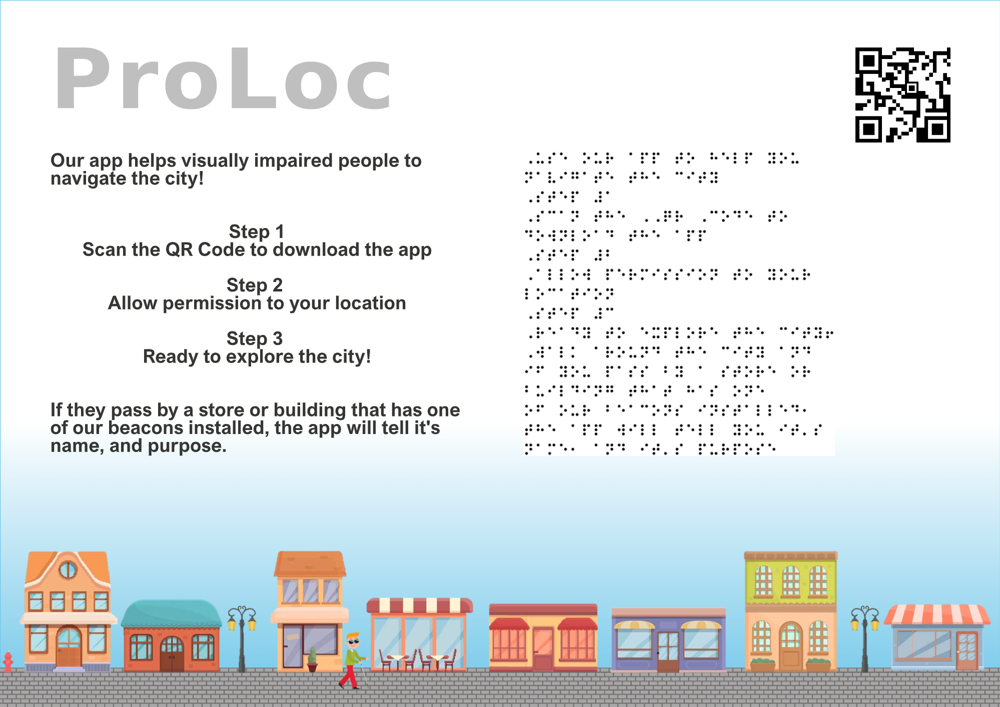

# ProLoc
This project defines and implements a prototype for the ProLoc application. ProLoc will help visually impaired people to naviagte the city. The app is pretty simple and it should be as lightweight as possible, so the users aren't overwhelmed by the features but rather have a ready to use experience. 
While running, the app is always looking out for beacons. If one is found, the ID of the beacon will be checked in our database and if it is a match, the name of the according building will be returned and showed to the user as a push notification. If the user has turned on the integrated operating aids of his smartphone, the push notification will be read to him by the voice assistance. In the app the user can also define if he is looking for something special, like a shopping center or the ZHAW, and the app will only notify him about relevant buildings. In the future it would also be possible to support public transportation.

# Diagram
This diagram shows the current setup, of our application. 
The system is build up from different parts all working over an HTTP event based system.

## Beacon Event
1) The [webhook](webhook) receives a beacon event send by Proxity.
   1) It will post a now correcly formatted json string to the [datbase coud function](cloud functions). 
2) The cloud functions will be triggered and then insert the new data, after creating it a new random id for it, into the firebase db.

## Frontend Display Event
1) The Frontend will fire the [datbase coud function](cloud functions) to get the 
   required information.
2) Cloud function will query the database for the required information.
   1) And return the results


# flutter_app

To run this flutter app the follow the steps in this tutorial: https://docs.flutter.dev/get-started/install
1. Install the Flutter SDK
2. Use the command flutter doctor to check if you installed the SDK correctly
3. Install the IDE: Android Studio (Windows/Linux) or Xcode (Mac)
4. Setup the Android Emulator (Windows/Linux) or the IOS simulator (Mac) and create a virtual device

Run the app:
1. Open the project with the IDE
3. Run the ```flutter pub get``` command to install all dependencies
4. Use the command ```flutter run``` to run the app on the virtual device

## Functionality of the app
The app is a prove of concept since the real app would need text to speech and further improvements to be used by a blind person.
* You can enter your device_id and it will fetch all data points associated to it from the firebase database.
* The app updates the data points each 2 seconds to guarantee that the newest data points are loaded.

# Goals
1) Event-driven: When a user is close to a beacon, an http trigger will fire the corresponding cloud function.
2) Attached to the physical world: Section 'ProLoc' of this READNE is explaining the real-life usage of this app.
3) Cloud-native: By using cloud functions that communicate with the firebase database (also a cloud service), the scalability of the google cloud platform is guaranteed. Even if an immense number of users are active and cause a request spike, the google cloud will be able to assure load balancing, reliability and add enough ressources.
4) Quality-assured: Software quality is assured as we use google cloud functions that tick off most security and reliability problems. Also, only the allowed http requests are processed. Furthermore, as seen in the section of the architecture diagram, the software is well structured, decoupled and interfaces are designed to make the app extendable. 

# Flyer


# Pitch Video
link to video
